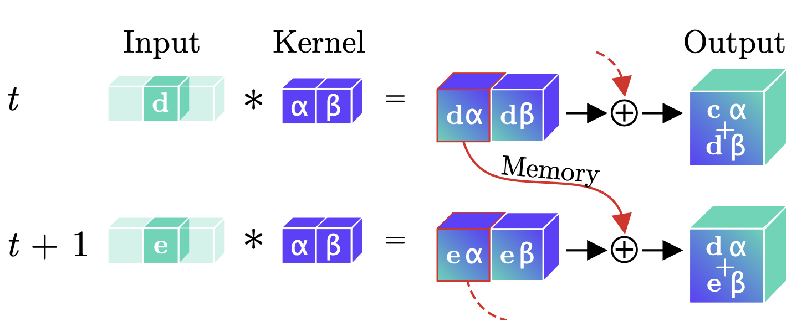
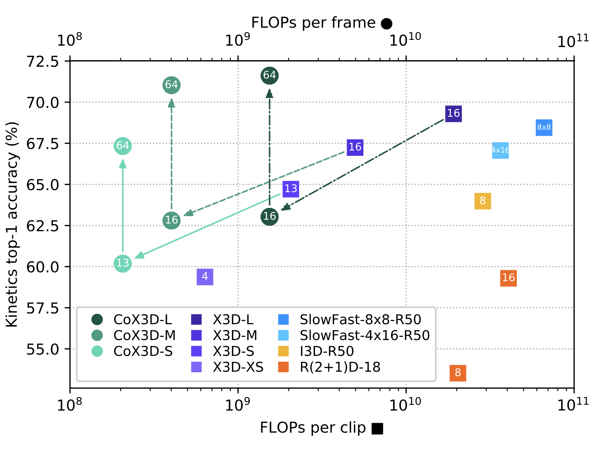
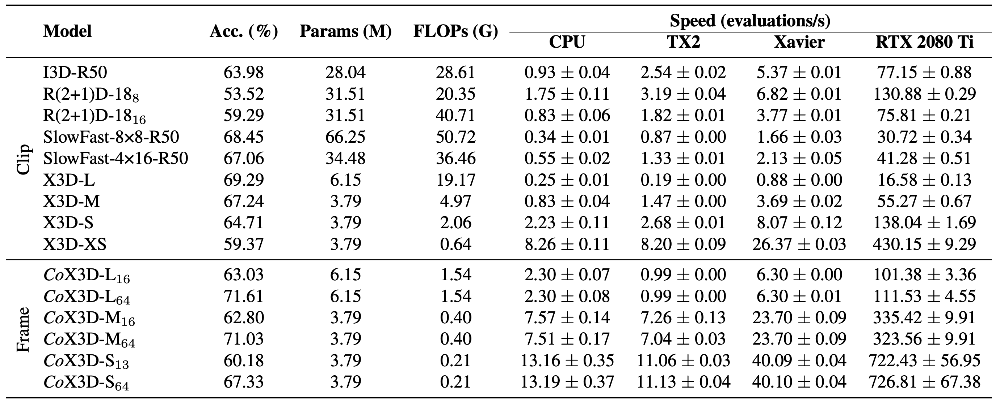

# Continual 3D Convolutional Neural Networks
[](https://arxiv.org/abs/2106.00050)
[](https://github.com/LukasHedegaard/ride)
[](https://codecov.io/gh/LukasHedegaard/co3d)
[](https://opensource.org/licenses/Apache-2.0)
[](https://github.com/psf/black)

Continual 3D Convolutional Neural Networks (Co3D CNNs) are a new computational formulation of spatio-temporal 3D CNNs, in which videos are processed frame-by-frame rather than by clip.

In online processing tasks demanding frame-wise predictions, Co3D CNNs dispense with the computational redundancies of regular 3D CNNs, namely the repeated convolutions over frames, which appear in multiple clips.

Co3D CNNs are weight-compatible with regular 3D CNNs, do not need further training, and reduce the floating point operations for frame-wise computations by more than an order of magnitude!


## Principle 

<div align="center">
  
  <br>
  Continual Convolution. 
	An input (green d or e) is convolved with a kernel (blue α, β). The intermediary feature-maps corresponding to all but the last temporal position are stored, while the last feature map and prior memory are summed to produce the resulting output. For a continual stream of inputs, Continual Convolutions produce identical outputs to regular convolutions.
</div>


## Results
<div align="center">
  
  <br>
  Accuracy/complexity trade-off for Continual X3D CoX3D and recent state-of-the-art 3D CNNs on Kinetics-400 using 1-clip/frame testing. 
  For regular 3D CNNs, the FLOPs per clip ■ are noted, while the FLOPs per frame ● are shown for the Continual 3D CNNs. 
  The CoX3D models used the weights from the X3D models without further fine-tuning.
  The global average pool size for the network is noted in each point.
  The diagonal and vertical arrows indicate respectively a transfer from regular to Continual 3D CNN and an extension of receptive field.

  <br>
  <br>

  
<br>
  Benchmark of state-of-the-art methods on Kinetics-400. The noted accuracy is the single clip or frame top-1 score using RGB as the only input-modality. 
  The performance was evaluated using publicly available pre-trained models without any further fine-tuning.
  For speed comparison, evaluations per second denote frames per second for the CoX3D models and clips per second for the remaining models. Speed results are the mean +- std of 100 measurements. 
</div>


# Setup

1. Clone the project code
    ```bash
    git clone https://github.com/LukasHedegaard/co3d
    cd co3d
    ```

1. Create and activate `conda` environent (optional)
    ```bash
    conda create --name co3d python=3.8
    conda activate co3d
    ```

1. Install Python dependencies
    ```bash
    pip install -e .[dev]
    ``` 

1. Install [FFMPEG](https://ffmpeg.org) and [UNRAR](https://www.rarlab.com/rar_add.htm)

1. Fill in the information on your dataset folder path in the `.env` file

1. Download dataset using [these instructions](datasets/README.md)


# Usage
The project code written in PyTorch and uses [Ride](https://github.com/LukasHedegaard/ride) to provide implementations of training, evaluations, and benchmarking methods.
A plethora of usage options are available, which are best explored in the [Ride docs](https://ride.readthedocs.io) or the command-line `--help`.

This repository contains the implementations of Continual X3D (CoX3D), as well as number of 3D-CNN baselines.

Each model has its own folder with a self-contained implementation, scripts, weight download utilities, hparams and profiling results.


## CoX3D

_CoX3D_ is Continual-CNN implementation of X3D.
In contrast to regular 3D CNNs, which take a whole video clip as input, Continual CNNs operate frame-by-frame and can thus speed up computation by a significant margin.

See the [CoX3D README](models/cox3d/README.md) and command-line help
```bash
python models/cox3d/main.py --help 
```


## X3D
_X3D_ [[ArXiv](https://arxiv.org/abs/2004.04730), [Repo](https://github.com/facebookresearch/SlowFast)] is a family of 3D variants of the EfficientNet achitecture, which produce state-of-the-art results for lightweight human activity recognition.

See the [X3D README](models/x3d/README.md) and command-line help
```bash
python models/x3d/main.py --help 
```


## R(2+1)D
_R(2+1)D_ [[ArXiv](https://arxiv.org/abs/1705.07750), [Repo](https://pytorch.org/vision/stable/models.html#torchvision.models.video.r2plus1d_18)] is a CNN for activity recognition, which separates the 3D convolution into a spatial 2D convolution and a temporal 1D convolution in order to reduce the number of parameters and increase the network efficiency.

See the command-line help
```bash
python models/r2plus1d/main.py --help 
```


## I3D
_I3D_ [[ArXiv](https://arxiv.org/abs/1705.07750), [Repo](https://github.com/deepmind/kinetics-i3d)] is a 3D CNN for activity recognition, proposed to "inflate" the weights from a 2D CNN pretrained on ImageNet in the initialisation of the 3D CNN, thereby improving accuracy and reducing training time.

The implementation here is a port of the one found in the [SlowFast Repo](https://github.com/facebookresearch/SlowFast).

See the [I3D README](models/i3d/README.md) and command-line help:
```bash
python models/i3d/main.py --help 
```


## SlowFast
_SlowFast_ [[ArXiv](https://arxiv.org/abs/1812.03982), [Repo](https://github.com/facebookresearch/SlowFast)] is a family of 3D CNNs for video-recognition, which produce state-of-the-art results for lightweight human activity recognition. 
They are structured with two pathways with one pathway operating at a slower frame-rate than the other.

See the [SlowFast README](models/slowfast/README.md) and command-line help
```bash
python models/slowfast/main.py --help 
```


# Citation   
```
@article{hedegaard2021continual,
  title={Continual 3D Convolutional Neural Networks for Real-time Processing of Videos},
  author={Lukas Hedegaard and Alexandros Iosifidis},
  journal={TBD},
  year={2021}
}
```
